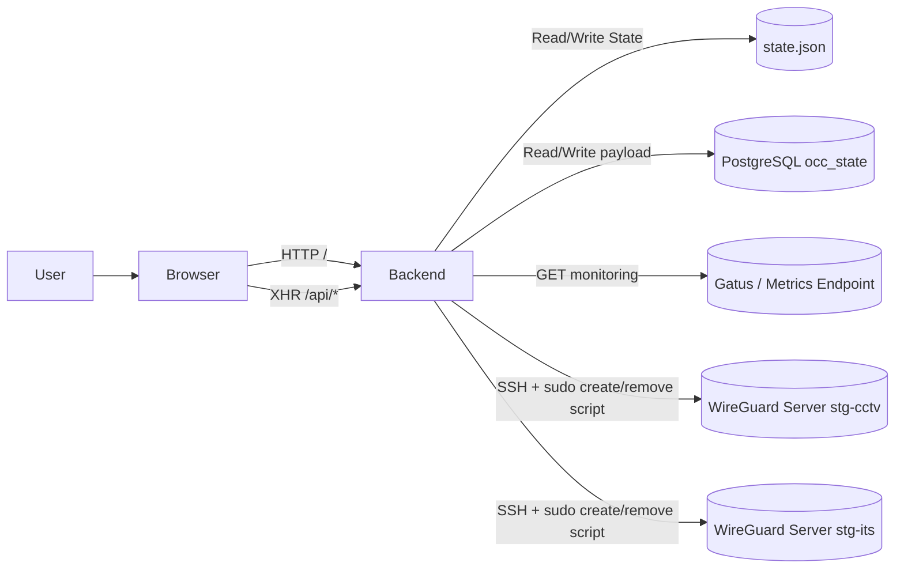
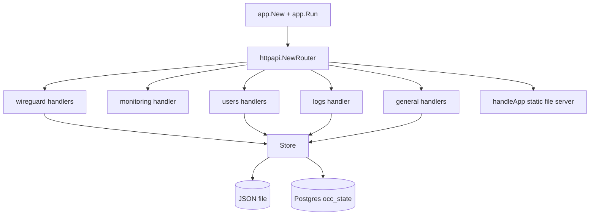

# Architecture

## Overview
`occ-jtt` adalah aplikasi web monorepo dengan dua komponen utama:

- Backend Go (`backend/`) yang menyediakan REST API, session auth berbasis cookie, state management, dan integrasi remote WireGuard.
- Frontend React + Vite (`frontend/`) sebagai single-page admin UI yang memanggil API backend.

Aplikasi dijalankan sebagai single backend process (`occ-jtt`) yang juga menyajikan aset frontend build (`frontend/dist`) dari route `/`.

## High-Level Components

### Frontend
- Entry: `frontend/src/main.jsx`
- App utama: `frontend/src/App.jsx`
- Fungsi utama UI:
  - Login/logout + session restore
  - Dashboard health
  - Monitoring (data dari backend)
  - Create/delete peer
  - Inventory peer
  - User management
  - Audit logs viewer

### Backend
- Entry points:
  - `backend/main.go`
  - `backend/cmd/occ/main.go`
- Komposisi aplikasi: `backend/internal/app/app.go`
- Routing: `backend/internal/httpapi/router.go`
- Handler domains:
  - `general` (health, dashboard)
  - `monitoring`
  - `wireguard`
  - `users`
  - `logs`
  - `mikrotik` (placeholder)

### State Storage Layer
`backend/internal/store/store.go` menyimpan seluruh state aplikasi dalam satu model `State`:

- `network`
- `peers`
- `users`
- `logs`

Mode storage:
- File JSON (`OCC_JTT_DATA`, default `data/state.json`)
- PostgreSQL (`DATABASE_URL`) menggunakan tabel tunggal `occ_state` dengan kolom `payload JSONB`

### External Integrations
- PostgreSQL (`github.com/lib/pq`) untuk mode DB.
- Gatus / metrics endpoint untuk monitoring (`GATUS_API_URL`).
- Remote WireGuard servers via SSH + sudo command execution:
  - create script: `/usr/local/bin/occ-wg-create-outlet`
  - remove script: `/usr/local/bin/occ-wg-remove-peer`
- Local host utilities untuk diagnostics:
  - `ping`
  - `ssh`

Detail channel komunikasi ke WG server:
- command create/remove dijalankan sebagai `ssh ... sudo -n <script> --site <siteName>`
- output remote wajib JSON agar bisa diparse sebagai `RemoteScriptResult`

## Runtime Communication

## Internal Backend Composition

## Security and Access Model
- Auth: login menghasilkan cookie `occ_session` (in-memory map session di process backend).
- Authorization:
  - Session required: sebagian besar endpoint `/api/*`
  - Administrator required: network update, logs, users, server diagnostics
- CORS middleware mengizinkan origin caller, credential cookie, dan method `GET,POST,PUT,DELETE,OPTIONS`.

## Important Architectural Notes
- Tidak ada background worker backend terpisah; semua aksi dipicu request HTTP.
- UI melakukan polling periodik untuk dashboard dan monitoring (client-side scheduling).
- Integrasi WireGuard aktual dilakukan via remote shell script; backend hanya orchestration + persist state.
- Migration SQL `000001_*` membuat normalized schema, namun runtime store saat ini menggunakan tabel `occ_state` (JSONB snapshot) via `000002_*`/auto schema ensure.
- Site peer create saat ini tidak memiliki compensating transaction lintas server; jika server kedua gagal setelah server pertama sukses, cleanup dilakukan manual.
