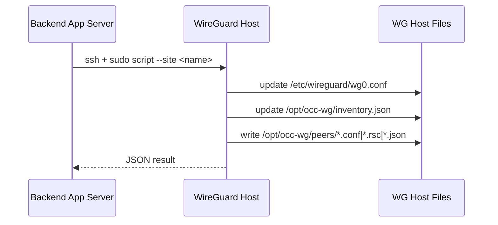

# Scripts and Automation Module

## Purpose
Ringkasan script otomasi repository:
- root scripts (`dev.sh`, `deploy.sh`)
- remote WireGuard scripts (`server-scripts/`)

## Root Automation Scripts

### `dev.sh`
Tujuan: local dev loop.

Urutan:
1. Verify `frontend/node_modules`.
2. Set default SSH key env (`STG_CCTV_SSH_KEY_PATH`, `STG_ITS_SSH_KEY_PATH`).
3. `npm run build` (frontend).
4. `go test ./...` (backend).
5. `go run .` (backend).

### `deploy.sh`
Tujuan: deploy/rebuild server dengan service systemd.

Urutan:
1. Optional `git pull --ff-only`.
2. Build frontend (`npm install` optional + `npm run build`).
3. Build backend binary (`go build -o occ-jtt`).
4. Restart service (`systemctl restart <SERVICE_NAME>`).
5. Cek logs, listening port, state file, health endpoint.

## Remote WireGuard Scripts

### File di Repository
- `occ-wg-create-outlet-stg-cctv.sh`
- `occ-wg-remove-peer-stg-cctv.sh`
- `occ-wg-create-outlet-stg-its.sh`
- `occ-wg-remove-peer-stg-its.sh`

### Command Name Expected by Backend
Dari `defaultWGServers()` backend, path default yang dipanggil remote adalah:
- create: `/usr/local/bin/occ-wg-create-outlet`
- remove: `/usr/local/bin/occ-wg-remove-peer`

Artinya, script repo yang bersifat server-specific biasanya di-deploy/copy menjadi nama command di atas pada masing-masing host WG.

## Create Script Behavior
Input:
- `--site <siteName>`

Proses:
1. Validasi dependency (`wg`, `wg-quick`, `jq`, `flock`, dll).
2. Sanitasi site name.
3. Lock file global (`/opt/occ-wg/.lock`).
4. Alokasi IP bebas dari pool server (`10.21.*` atau `10.22.*`).
5. Generate key material.
6. Backup `WG_CONF` lalu append peer block.
7. Apply config dengan `wg syncconf`.
8. Jika apply gagal: rollback `WG_CONF` dari backup.
9. Tulis artifact files (`.conf`, `.rsc`, `.json`) di `/opt/occ-wg/peers`.
10. Update inventory JSON `/opt/occ-wg/inventory.json`.
11. Output JSON sukses/gagal.

## Remove Script Behavior
Input:
- `--site <siteName>`

Proses:
1. Validasi dependency.
2. Lock file global.
3. Verifikasi marker block peer ada di `WG_CONF`.
4. Backup lalu hapus block peer (`BEGIN_PEER ... END_PEER ...`).
5. Apply `wg syncconf`.
6. Jika apply gagal: rollback dari backup.
7. Hapus artifact files site.
8. Hapus entry site dari inventory JSON.
9. Output JSON sukses/gagal.

## Script Contract With Backend

### Create JSON (subset penting)
- `ok`
- `applied`
- `server_id`
- `interface`
- `assigned_ip`
- `overlay`
- `peer_file`
- `router_file`
- `peer_content`
- `router_content`
- `error` (jika gagal)

### Remove JSON (subset penting)
- `ok`
- `removed`
- `server_id`
- `site`
- `error` (jika gagal)

## Server Communication Flow

## Naming Note (Current Code Reality)
- Backend peer type sudah `site`.
- Remote script filenames/command names masih menggunakan istilah `outlet` pada create path.
- Ini kompatibel karena backend hanya membutuhkan contract output JSON + script path yang benar.

## Operational Constraints
- App server harus bisa SSH ke host WG dengan key yang valid.
- User remote harus bisa menjalankan script via `sudo -n`.
- Script memodifikasi file sistem WireGuard secara langsung.
