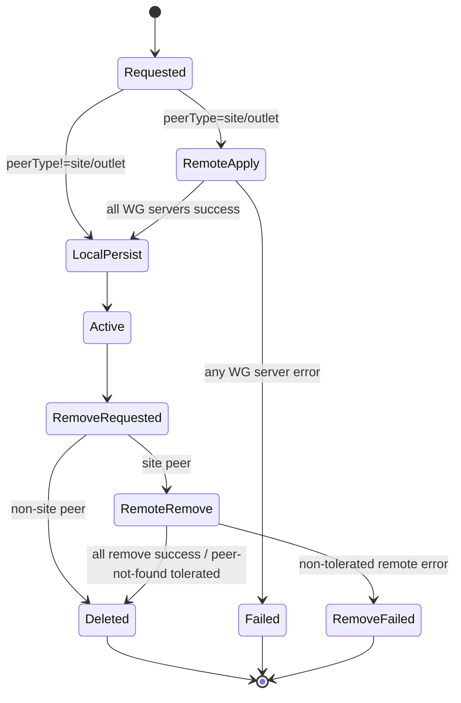
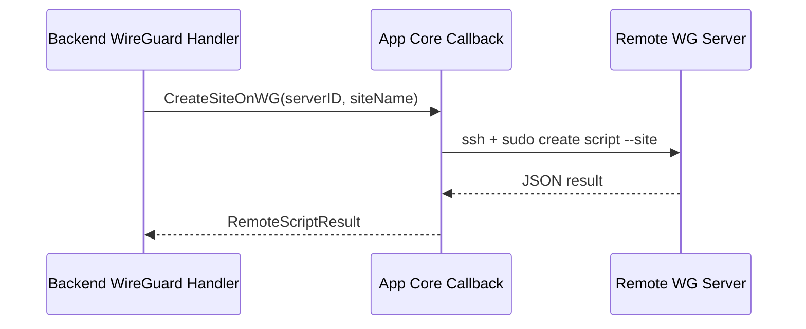

# WireGuard Module

## Purpose
`backend/internal/httpapi/wireguard` menangani domain WireGuard di API:
- update network config
- create/delete peer
- download config/artifacts
- diagnostics peer dan diagnostics server WG

## Main Files
- `handler.go`
- `helpers.go`
- `peers_create.go`
- `peers_remove.go`
- `peers_inventory.go`
- `server_connection.go`
- `peers_update.go` (placeholder, belum implementasi)

## Endpoint Surface
- `PUT /api/network`
- `GET /api/peers`
- `POST /api/peers`
- `DELETE /api/peers/{id}`
- `GET /api/peers/{id}/config`
- `GET /api/peers/{id}/artifacts/{artifactId}`
- `GET /api/diagnostics/peers`
- `GET /api/wg-servers`
- `GET /api/wg-servers/diagnostics`

## Peer Lifecycle

### 1) Create Site Peer
Trigger: `POST /api/peers` dengan `peerType` = `site` (legacy `outlet` juga diterima).

Flow runtime:
1. Validasi `name` (siteName).
2. Iterasi `ListWGServers()` (default order: `stg-cctv`, lalu `stg-its`).
3. Untuk tiap server, jalankan callback `CreateSiteOnWG`.
4. Callback app-core menjalankan SSH remote script:
   - `ssh ... sudo -n <createScript> --site <siteName>`
5. Backend mengumpulkan:
   - `assignments` (`serverId`, `interfaceName`, `assignedIP`, `overlayCIDR`)
   - `artifacts` (`conf` dan `rsc`)
6. Persist peer dengan `type: "site"`.
7. Tulis audit log `wireguard:create`.

Failure semantics:
- Jika salah satu server gagal create/return invalid result, request langsung gagal (`502`), dan peer tidak disimpan ke store.
- Tidak ada kompensasi otomatis untuk server yang sudah sempat sukses sebelum server berikutnya gagal.

### 2) Create Administrator Peer
Trigger: `POST /api/peers` selain `peerType` site/outlet.

Flow runtime:
1. Validasi `name`, `publicKey`, `assignedIP`.
2. Simpan peer lokal ke store.
3. Tulis audit log `wireguard:create`.

Tidak ada remote script execution untuk jalur ini.

### 3) Delete Peer
Trigger: `DELETE /api/peers/{id}`.

Flow runtime:
1. Load peer by id.
2. Jika peer dikenali sebagai site peer (`type=site`, legacy `outlet`, atau assignment ada):
   - iterasi assignments
   - panggil `RemoveSiteFromWG` per server
3. Jika remote sukses (atau error `peer not found`), lanjut hapus peer dari store.
4. Tulis audit log `wireguard:delete`.

Failure semantics:
- Jika remove remote gagal dan bukan `peer not found`, delete dibatalkan (`502`) dan peer tetap ada di store.

## Lifecycle Diagram

## Server Communication Details

### Remote Apply/Remove Channel
Dari app server ke WG server:
- transport: SSH
- key path: `WGServerConfig.KeyPath`
- command:
  - create: `sudo -n <CreateScript> --site <siteName>`
  - remove: `sudo -n <RemoveScript> --site <siteName>`
- result format: JSON (`RemoteScriptResult`)

### Diagnostics Channel
- Peer diagnostics: `ping -c 1 -W 1 <assignedIP>`
- WG server diagnostics:
  - ping host WG
  - SSH handshake latency (`ssh ... exit`)

## Important Types
- `WGServerConfig`
- `RemoteScriptResult`
- `peerInput`

## Dependencies
- `internal/store`
- `internal/wg` (render config)
- callback dari app-core:
  - `CreateSiteOnWG`
  - `RemoveSiteFromWG`
  - `PingLatency`
  - `SSHHandshakeLatency`
