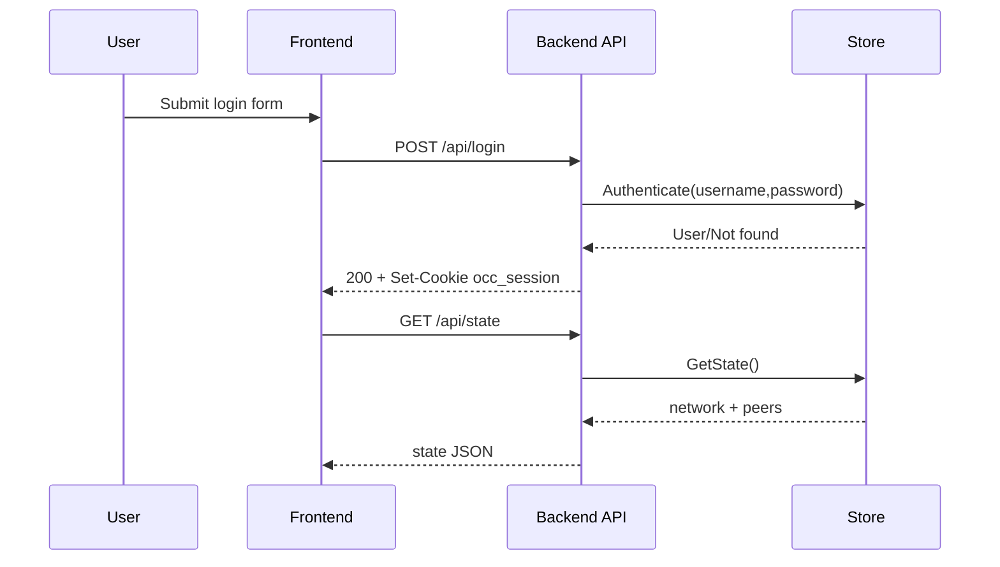
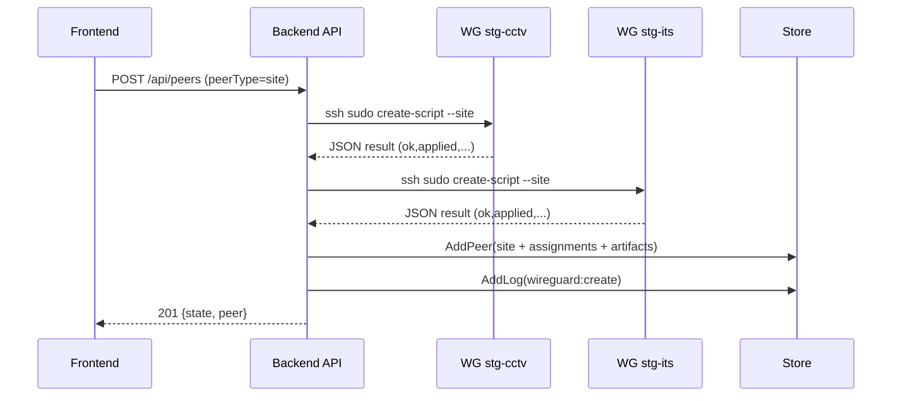
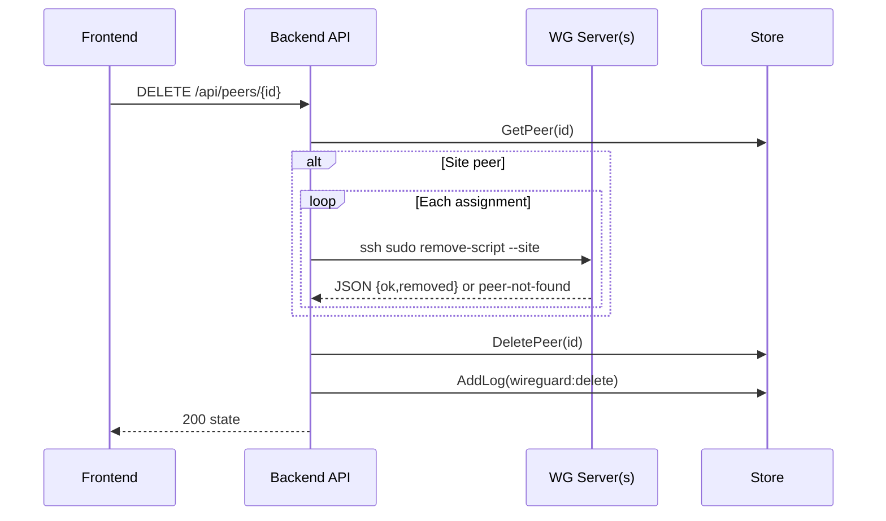

# System Flow

## 1) Login and Session Establishment

1. User submit username/password dari UI.
2. Frontend `POST /api/login`.
3. Backend validasi user via `store.Authenticate`.
4. Backend generate session ID, simpan di memory map `server.sessions`, set cookie `occ_session`.
5. Frontend lanjut `GET /api/state`.

## 2) Site Peer Create Flow (Normal Path)

Flow ini dipakai jika `peerType` adalah `site` (legacy `outlet` juga diterima).

1. Frontend `POST /api/peers`.
2. Backend `createSitePeer` iterasi server dari `ListWGServers()` (default: `stg-cctv`, lalu `stg-its`).
3. Per server, backend jalankan remote command via SSH:
   - `sudo -n <create_script> --site <siteName>`
4. Script remote update WG config + artifacts + inventory, lalu return JSON.
5. Setelah semua server sukses, backend menyusun assignments/artifacts.
6. Backend `AddPeer(type=site)` ke store.
7. Backend `AddLog(category=wireguard, action=create)`.
8. Response `201 {state, peer}`.

## 3) Site Peer Create Flow (Failure Path)

1. Jika salah satu remote create gagal / return invalid result:
   - Backend langsung `502`.
2. Peer tidak disimpan ke store.
3. Tidak ada rollback otomatis ke server lain yang sudah terlanjur sukses.

## 4) Administrator Peer Create Flow

1. Frontend `POST /api/peers` non-site.
2. Backend validasi `name`, `publicKey`, `assignedIP`.
3. Backend simpan peer lokal ke store.
4. Backend tulis audit log.
5. Response `201 {state, peer}`.

Catatan:
- Tidak ada remote script execution untuk jalur ini.
- Payload frontend `targetServer`/`purpose` saat ini tidak dipakai backend.

## 5) Peer Delete Flow

1. Frontend `DELETE /api/peers/{id}`.
2. Backend load peer by ID.
3. Jika peer adalah site peer:
   - iterasi assignments
   - jalankan remove script remote per server
   - error `peer not found` ditoleransi
4. Jika remove remote berhasil (atau peer-not-found), backend hapus peer dari store.
5. Backend tulis audit log delete.

Failure rule:
- Jika remove remote gagal dan bukan `peer not found`, response `502` dan peer tidak dihapus dari store.

## 6) Network Config Update Flow

1. Admin UI `PUT /api/network`.
2. Backend validasi payload minimal.
3. Backend update `state.network`.
4. Backend tulis audit log `wireguard:update`.
5. Response state terbaru.

## 7) Server Communication Diagnostics Flow

### WG Server Diagnostics (`/api/wg-servers/diagnostics`)
1. Backend iterasi semua WG server config.
2. Backend ping host server.
3. Backend ukur SSH handshake latency (`ssh ... exit`).
4. Return status `up/down`, latency, dan error message.

### Peer Diagnostics (`/api/diagnostics/peers`)
1. Backend iterasi peers dan target assignment.
2. Backend ping `assignedIP`.
3. Return status + latency per target.

## 8) Monitoring Flow

1. Frontend polling `GET /api/monitoring` tiap 5 menit saat Monitoring view aktif.
2. Backend request `GATUS_API_URL`.
3. Jika response JSON valid -> diteruskan.
4. Jika response metrics text -> diparse jadi list metrics.
5. Frontend melakukan grouping/filter/sort untuk rendering.

## 9) Dashboard Health Flow

1. Frontend polling `GET /api/dashboard/health` tiap 5 menit saat Dashboard view aktif.
2. Backend melakukan ping ke:
   - `google.com`
   - host tiap WG server
   - gateway host (`DASHBOARD_GATEWAY_HOST`)
3. Backend return item status + latency + checkedAt.

## 10) User and Logs Flow

### User Management
- `GET /api/users`
- `POST /api/users`
- `PUT /api/users/{username}`

Setiap create/update user menambah audit log category `user`.

### Logs Retrieval
- Frontend memanggil `GET /api/logs?category=<wireguard|mikrotik|user>`.
- Backend validasi category dan return logs dari store.

## 11) Static SPA Serving Flow

1. Request non-API masuk `handleApp`.
2. Backend coba serve file di `../frontend/dist`.
3. Jika file target tidak ada, serve `index.html` untuk SPA fallback.
4. Jika frontend belum dibuild, route `/` return fallback HTML sederhana.
